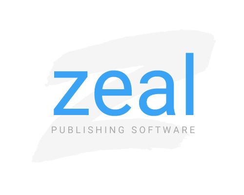

  

# What is Zeal?

Zeal is a publishing software that enables users to create articles for audiences to read. This software was created as a demonstration of creating a REST API application using Spring and is intended for pedagogical use. The source code contained in this repository is structured to provide an example of a working Spring REST application and allow readers to follow the workflow of developing a Spring REST application for themselves.
